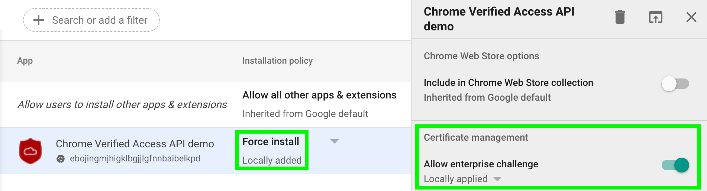
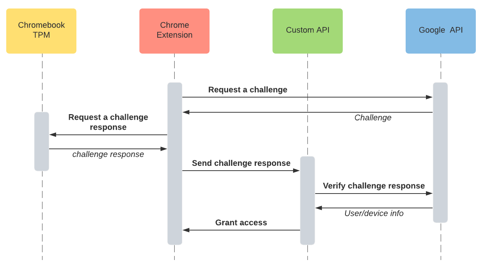
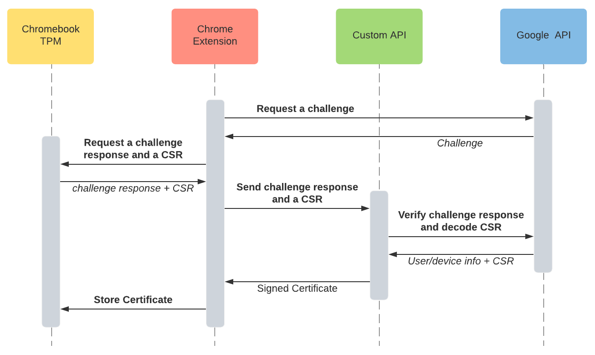
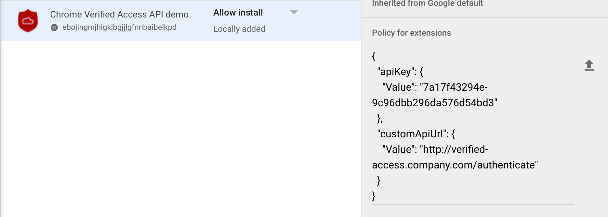

# Chrome Verified Access API demo extension

This Chrome extension demonstrates how to authenticate a Chromebook device or user based on the [Chrome Verified Access API](https://developers.google.com/chrome/verified-access).

From the documentation: *"The Chrome Verified Access API allows network services, such as VPNs, intranet pages, and so on to cryptographically verify that their clients are genuine and conform to corporate policy."*

You can find this extension in the [Chrome Web Store](https://chrome.google.com/webstore/detail/chrome-verified-access-ap/ebojingmjhigklbgjjlgfnnbaibelkpd?hl=en&authuser=0).

## Setup

To use the Chrome Verified API, you MUST have your Chromebooks enrolled in a Google Admin tenant (you can get a trial account [here](https://support.google.com/chrome/a/answer/7679452?hl=en&ref_topic=9050345)).

Then you have to **force install** the extension that use Chrome Verified Access. You must also enable the *Allow enterprise challenge* option in the *Certificate management* block. This block is displayed only for extensions that use the *enterprise.platformKeys* permission.

If you develop your own extension and publish it in the Chrome Web Store, you may experience a few hours delay before the *Certificate management* block appears in the Google Admin console.

## Server counterpart of the demo

To demonstrate the full authentication process, you'll need an API server that will submit authentication material to Google API, and eventualy sign a CSR.

You can find such a server, developped by a colleague, here: [verified-access-service](https://github.com/catac/verified-access-service).

## Simple scenario

In this scenario, Verified Access is used by a custom API (or web site) to authenticate user/device and to grant access.

This scenario contains the following steps:

* Step 1: Enter your Google API key that you created in [Google Cloud Platform admin console](https://console.cloud.google.com/)
* Step 2: Request a challenge from Google API. The extension will call the [challenge.create](https://developers.google.com/chrome/verified-access/reference/rest/v1/challenge/create) API method from Google servers
* Step 3: Generate a challenge response locally. You have to select which kind of reponse you want to generate:

  * A user response - to identify the logged Enterprise user
  * A device response - to identify the Enterprise's Chromebook

  Then you have to choose if you want to include a Certificate Signing Request (CSR) in the response (see the *Certificate enrollment scenario* bellow)
* Step 4: Enter the identity you expect to find in the response. The [challenge.verify](https://developers.google.com/chrome/verified-access/reference/rest/v1/challenge/verify) API method requires the caller to provide expected identity to answer. The extension automatically collect the current user identity with the local [chrome.identity.getProfileUserInfo](https://developer.chrome.com/apps/identity) API call. If the type of response is *device*, only the domain part of the user email address is kept
* Step 5: Enter your custom API Server url. This server will have to send provided identity and challenge response to the [challenge.verify](https://developers.google.com/chrome/verified-access/reference/rest/v1/challenge/verify) API to verify the challenge and authenticate the user/device
* Step 6: Send data to your custom API Server and visualize its answer.

## Certificate enrollment scenario

In this scenario, Verified Access is used to authenticate a user/device and generate a Certificate Signing Request for a TPM backed client certificate. Here you may use a custom server that will check Verified Access material provided by the user/device and then sign the CSR.

This scenario is prefered because the whole Verified Access authentication process can take up to 10 seconds depending of the Chromebook you have. So it's not really suitable for granting access to a website for example, as the user will have to wait a long time before accessing resources.

Once the client certificate has been deployed on the Chromebook, you can use this certificate to instantly authenticate user/device. Just configure your website to require SSL client based authentication (see [Configuring Apache for SSL Client Certificate Authentication](https://stuff-things.net/2015/09/28/configuring-apache-for-ssl-client-certificate-authentication/), or [Client-side certificate authentication with nginx](https://fardog.io/blog/2017/12/30/client-side-certificate-authentication-with-nginx/)).

The scenario is exactly the same as the simple scenario, except for 2 'bonus' steps:

* Bonus step 1: Import issued certificate into the TMP
* Bonus step 2: List all certificates stored in TPM.

## Extension configuration

This extension support pre-configuration with Google Admin Policy.

You can find a sample config in: [doc/config-sample.json](doc/config-sample.json).

This configuration goes in the *Policy for extensions* block in the application settings of the Google Admin Console.

## Thanks

Special thanks to J.P. Combe from Google France for his help and for providing the certificate handling part of the code.